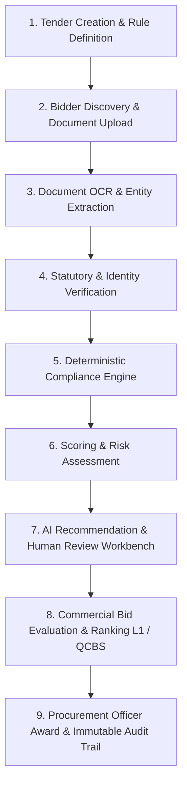

# BidVerify AI

**Next-Generation AI-Powered Integrated Bid Compliance Verification & Commercial Evaluation Platform for Government Procurement (GeM / SIH 2026)**

[](https://fastapi.tiangolo.com/)
[](https://nextjs.org/)
[](https://www.postgresql.org/)
[](https://github.com/PaddlePaddle/PaddleOCR)
[](#)

---

## 📌 Executive Summary

Government procurement portals (such as the Government e-Marketplace - GeM) process millions of tenders annually. Evaluating technical compliance, financial turnover, statutory registrations, and commercial quotes across thousands of pages of multi-format bidder PDFs is prone to manual errors, delays, non-compliance leakage, duplicate shell-company bidding, and vendor bias.

**BidVerify AI** is an enterprise-grade, transparent, and auditable procurement compliance platform designed to automate end-to-end bid validation. It follows the core principle:

$$\textbf{Upload Once} \longrightarrow \textbf{Extract Automatically} \longrightarrow \textbf{Verify Authoritatively} \longrightarrow \textbf{Evaluate Deterministically} \longrightarrow \textbf{Award Transparently}$$

---

## 🚀 Key Features & Highlights

- 📄 **Intelligent Document AI**: Dual-mode extraction using **PyMuPDF** for digital PDFs and **PaddleOCR + OpenCV** image pre-processing for scanned certificates.
- 🏛️ **Statutory Verification Engine**: Authoritative cross-verification of **GSTIN, PAN, Udyam MSME, MCA CIN/LLPIN, Startup India, NSIC, EPFO, and ESIC**.
- 🔍 **Organization Identity & Duplicate Entity Detection**: Detects duplicate bidding entities, shared PAN/GSTIN/Udyam registrations, identical director names, and common registered office addresses.
- ⚙️ **Deterministic Compliance Rule Engine**: Zero-hallucination rule validation across statutory, financial (turnover, profitability), technical, and experience criteria.
- 📊 **Dynamic Scoring & Deterministic Risk Matrix**: Category-wise weighted scoring (0–100%) paired with a calibrated risk engine and critical failure floors.
- ⚖️ **Tender Evaluation Methods & Commercial Comparison**:
  - **L1 Lowest Compliant Bid**: Automatically filters out non-compliant bids before ranking by price; handles commercial ties explicitly.
  - **QCBS (Quality & Cost Based Selection)**: Configurable weighted scoring (e.g., 70% Technical + 30% Financial) with Decimal-safe mathematical formulas.
  - **Safety Review Blockers**: Flags top-ranked bidders with unresolved critical human review items (`RANKED #1 BUT REVIEW REQUIRED`).
- 🤖 **Evidence-Grounded AI Recommendation**: AI provides contextual summaries and justification cards with exact document page citations—**never auto-disqualifying or auto-awarding on its own**.
- 🛡️ **Procurement Officer Sovereignty**: Authoritative decisions remain strictly with the human Procurement Officer.
- 🔒 **Immutable Audit Ledger**: Tamper-proof, append-only audit trail logging all lifecycle events, extraction snapshots, and verification results.

---

## 🔄 End-to-End Workflow (Step-by-Step)



### Step 1: Tender Creation & Rule Definition (Procurement Officer)
* The Procurement Officer creates a tender, setting estimated contract value, submission deadlines, and categorizing procurement type (Goods, Services, Works).
* Builds mandatory and non-mandatory requirement clauses (e.g., minimum 3-year average turnover of ₹5 Crore, ISO 9001, active GST registration).
* Selects the commercial evaluation methodology:
  * **Lowest Compliant Bid (L1)**
  * **Quality & Cost Based Selection (QCBS)** with custom weights (e.g., 70% Technical / 30% Financial).

### Step 2: Bidder Profile & Proposal Submission (Bidder)
* The Bidder completes their statutory organization profile (PAN, GSTIN, Udyam MSME, Bank details).
* Uploads required bid documents (audited balance sheets, registration certificates, past work orders, OEM authorization).
* The platform checks submission readiness and locks the bid package upon final submission.

### Step 3: Document Processing & Entity Extraction (Document AI)
* **Digital PDFs**: Extracted using **PyMuPDF** (`pymupdf`) for 100% fidelity vector text and structural tables.
* **Scanned Images & Certificates**: Preprocessed using **OpenCV** (deskewing, adaptive thresholding) and extracted via **PaddleOCR**.
* **Classification & Extraction**: Documents are classified into types (GST Certificate, Financial Statement, etc.) and parsed into structured JSON fields (turnover figures, dates, PAN/GSTIN numbers, certificate validity).

### Step 4: Authoritative Registry Verification & Identity Matching
* Validates extracted entities against verification adapters (GST portal, Income Tax PAN registry, MSME Udyam, MCA Ministry of Corporate Affairs).
* Checks cross-document consistency (e.g., legal name on PAN matches GSTIN and Udyam certificate).
* Runs the **Duplicate Entity Detection Graph** to flag shell companies or multiple bids sharing the same PAN, GSTIN, directors, or address tokens.

### Step 5: Deterministic Compliance Engine
* Evaluates extracted and verified values against tender requirement rules using strict mathematical and logical operators (`GREATER_THAN_OR_EQUAL`, `EQUALS`, `DATE_BEFORE`, `CONTAINS`, `EXISTS`).
* Produces immutable rule determinations: `PASS`, `FAIL`, `REVIEW`, `NOT_APPLICABLE`, or `PENDING`.
* Links every result directly to the source document evidence and page number.

### Step 6: Scoring, Risk Calculation & AI Explanations
* **Compliance Score (0–100%)**: Computed based on category-wise weights (Statutory, Financial, Technical, Experience).
* **Deterministic Risk Engine**: Calculates risk levels (`LOW`, `MEDIUM`, `HIGH`, `CRITICAL`). Applies automatic critical floor overrides if mandatory compliance rules fail.
* **AI Summary & Recommendation**: Contextual explanation grounded in verified evidence, highlighting strengths, weaknesses, and required review points.

### Step 7: Human Review & Decision Workbench (Procurement Officer)
* Flagged exceptions and discrepancy items are routed to the **Human Review Workbench**.
* The Procurement Officer inspects side-by-side evidence cards and resolves items (`CONFIRM_PASS`, `CONFIRM_FAIL`, `WAIVE`).
* The officer records the final authoritative qualification decision (`QUALIFIED`, `DISQUALIFIED`, `UNDER_REVIEW`).

### Step 8: Commercial Evaluation & Bid Ranking
* **Mandatory Eligibility Gate**: Excludes bids that failed mandatory compliance (`INELIGIBLE_MANDATORY_FAILED`).
* **L1 Ranking**: Lowest eligible compliant bid is ranked as L1. In case of equal quotes, an explicit `COMMERCIAL TIE` is declared without random selection.
* **QCBS Ranking**:
  $$\text{Financial Score} = \left(\frac{\text{Lowest Eligible Price}}{\text{Bidder Quoted Price}}\right) \times 100$$
  $$\text{Final Score} = (\text{Technical Score} \times \text{Tech Weight}) + (\text{Financial Score} \times \text{Fin Weight})$$
* **Safety Blocker**: If the top-ranked bidder has pending critical reviews, the system flags `RANKED #1 BUT REVIEW REQUIRED`.

### Step 9: Award & Immutable Audit Trail
* Full end-to-end event logging in an append-only audit ledger.
* Exportable official evaluation summary reports for compliance review and statutory archiving.

---

## 🛠️ Technology Stack

| Layer | Technologies Used | Purpose |
| :--- | :--- | :--- |
| **Frontend UI/UX** | **Next.js 16 (App Router)**, **React 19**, **TypeScript**, **Tailwind CSS**, **Lucide Icons** | Responsive, government-grade procurement dashboard with role-based navigation. |
| **Backend API** | **FastAPI**, **Python 3.11+**, **Pydantic v2**, **Uvicorn**, **SQLAlchemy 2.0** | High-performance asynchronous REST API, data validation, and business logic execution. |
| **Database** | **PostgreSQL**, **Supabase Database & Storage** | Relational data persistence, encrypted metadata storage, and private document bucket storage. |
| **Document AI / OCR** | **PyMuPDF (fitz)**, **PaddleOCR**, **OpenCV**, **NumPy** | Text extraction, certificate OCR, image deskewing, and structured entity parsing. |
| **Testing & QA** | **Pytest**, **Custom Automated Test Suites**, **ESLint**, **Next.js Build Check** | 100% automated test coverage across compliance, scoring, duplicate detection, and workflows. |

---

## 🧠 How the AI & Compliance Model Works

```
   ┌─────────────────────────────────────────────────────────────┐
   │                     Uploaded Bid PDF                        │
   └──────────────────────────────┬──────────────────────────────┘
                                  ▼
      ┌───────────────────────────────────────────────────────┐
      │  PyMuPDF (Vector Text)  +  PaddleOCR (Scanned Images) │
      └───────────────────────────┬───────────────────────────┘
                                  ▼
      ┌───────────────────────────────────────────────────────┐
      │     Structured Entity Extractor (Regex + Pattern)     │
      └───────────────────────────┬───────────────────────────┘
                                  ▼
      ┌───────────────────────────────────────────────────────┐
      │          Statutory Registry Verification Engine       │
      │       (GST / PAN / Udyam / MCA / EPFO Verification)   │
      └───────────────────────────┬───────────────────────────┘
                                  ▼
      ┌───────────────────────────────────────────────────────┐
      │        Deterministic Compliance Rule Evaluators       │
      │       (Zero-Hallucination Math & Logic Operators)     │
      └───────────────────────────┬───────────────────────────┘
                                  ▼
      ┌───────────────────────────────────────────────────────┐
      │         Scoring (0-100%) & Calibrated Risk Engine     │
      └───────────────────────────┬───────────────────────────┘
                                  ▼
      ┌───────────────────────────────────────────────────────┐
      │   AI Recommendation + Evidence Citation (RAG Style)   │
      └───────────────────────────┬───────────────────────────┘
                                  ▼
      ┌───────────────────────────────────────────────────────┐
      │     Human Decision & Commercial Evaluation Cockpit    │
      └───────────────────────────────────────────────────────┘
```

1. **Deterministic Logic First**: All compliance determinations (pass/fail/turnover calculations) are computed using exact Python decimal mathematics—eliminating LLM hallucinations.
2. **AI as an Explanatory Co-Pilot**: The AI synthesizes findings, flags inconsistencies across documents, and prepares structured summaries with clickable document evidence citations.
3. **Safety by Design**: AI is never permitted to unilaterally disqualify a bidder or declare a contract award winner.

---

## 👥 Role-Based Access Control (RBAC)

| Feature / Action | Bidder | Procurement Officer | Auditor / Admin |
| :--- | :---: | :---: | :---: |
| Browse Published Tenders | ✅ | ✅ | ✅ |
| Submit & Manage Draft Bids | ✅ | ❌ | ❌ |
| Create & Publish Tenders | ❌ | ✅ | ✅ |
| Configure Evaluation Criteria (L1 / QCBS) | ❌ | ✅ | ❌ |
| View Bid Evaluation Matrix & Scores | ❌ | ✅ | ✅ |
| Resolve Human Review Flags | ❌ | ✅ | ❌ |
| Record Final Qualification & Award Decision | ❌ | ✅ | ❌ |
| View Complete Immutable Audit Ledger | ❌ | ✅ | ✅ |

---

## 💻 Installation & Local Setup

### 1. Prerequisites
- **Node.js** (v18.x or higher) and `npm`
- **Python** (v3.11 or higher)
- **PostgreSQL** instance (or Supabase connection)

### 2. Clone the Repository
```bash
git clone https://github.com/ADITHYA-1908/bid-compliance-platform.git
cd bid-compliance-platform
```

### 3. Backend Setup
```bash
cd backend

# 1. Create and activate virtual environment
python -m venv venv
# On Windows:
venv\Scripts\activate
# On Linux/macOS:
# source venv/bin/activate

# 2. Install dependencies
pip install -r requirements.txt

# 3. Configure environment variables (.env)
# Create a .env file with your DATABASE_URL, JWT_SECRET, etc.

# 4. Start the backend server
uvicorn app.main:app --reload --host 127.0.0.1 --port 8001
```

### 4. Frontend Setup
```bash
cd ../frontend

# 1. Install dependencies
npm install

# 2. Start the development server
npm run dev
```

Open [http://localhost:3000](http://localhost:3000) in your browser.

---

## 📑 Part 4C — OCR + OpenCV + PaddleOCR

Part 4C enables **BidVerify AI** to process scanned/image-based procurement PDFs and standalone images that lack machine-readable digital text streams.

> [!IMPORTANT]
> **Part 4C Scope Boundary**:
> Part 4C adds OCR processing for scanned/image-based documents. It does not perform document classification, structured field extraction, AI verification, compliance evaluation, or government API verification.

### 1. Dual-Path Routing Architecture (Digital PDF vs. Scanned PDF)
When a bid document is submitted for ingestion, the processing engine analyzes the embedded text quality:
* **Digital PDF Path (Part 4B)**: If PyMuPDF detects valid selectable digital text ($\ge 50$ total non-whitespace characters and $\ge 30$ characters/page average), the document is extracted directly via `PyMuPDF` and completes immediately as `DIGITAL_PDF` without invoking unnecessary OCR models.
* **Scanned PDF Path (Part 4C)**: If the document is an image-only/scanned PDF (`is_ocr_required = True`), the engine routes the document into the Part 4C OCR pipeline (`ExtractionMethod.OCR` or `ExtractionMethod.HYBRID`).

```
Uploaded Bid Document
        ↓
DocumentProcessing Record (QUEUED)
        ↓
Part 4B — PyMuPDF Text Analysis
        ↓
Digital Text Available?
   ├── YES ──→ PyMuPDF Digital Extraction ──→ DIGITAL_PDF (COMPLETED)
   └── NO  ──→ Part 4C OCR Pipeline
                    ↓
               Render PDF Pages to Images (200 DPI via PyMuPDF)
                    ↓
               OpenCV Preprocessing (Grayscale, Bilateral Denoise, CLAHE, Safe Deskew)
                    ↓
               PaddleOCR Deep Learning Engine (Detection + Recognition)
                    ↓
               Page-wise OCR Text & Bounding Boxes (1-indexed: [PAGE 1], [PAGE 2])
                    ↓
               Real OCR Confidence Telemetry (Document + Page-Level)
                    ↓
               Conservative Text Normalization (Preserving PAN, GSTIN, Udyam, ₹, Dates)
                    ↓
               Processing Result (COMPLETED / NEEDS_REVIEW / FAILED)
```

### 2. PDF Page Rendering (PyMuPDF)
- Multi-page PDFs are rendered page-by-page into OpenCV BGR image matrices in memory at a configurable resolution (`settings.OCR_RENDER_DPI`, default 200 DPI, range 200–300 DPI).
- The original uploaded document binary remains unchanged in secure private storage.
- All temporary rendering buffers and pixmaps are explicitly freed after execution.

### 3. Conservative OpenCV Preprocessing Pipeline
To maximize OCR text recognition accuracy on noisy, low-contrast, or faded government stamps without destroying statutory alphanumeric patterns:
1. **Grayscale Conversion**: Standardizes 3-channel BGR image matrices into single-channel luminance maps.
2. **Conservative Deskewing**: Rotates skewed scans if orientation angle is reliably detectable ($\pm 0.5^\circ \dots \pm 45^\circ$), strictly preserving document margins.
3. **Bilateral Filtering**: Smooths paper texture noise while preserving sharp character boundaries for critical identifiers (PAN: `ABCDE1234F`, GSTIN: `33ABCDE1234F1Z5`, Udyam: `UDYAM-TN-00-1234567`).
4. **CLAHE Contrast Enhancement**: Applies Contrast Limited Adaptive Histogram Equalization ($clipLimit=2.0, tileGrid=(8,8)$) to recover faded dot-matrix print and seals.

### 4. PaddleOCR Engine Integration & Telemetry
- **Model Execution**: Lazy-loaded singleton initialized with `use_angle_cls=True, lang=settings.OCR_LANGUAGE` (default English).
- **Page-wise Traceability**: Extracts text per page with 1-indexed headers (`[PAGE 1]`, `[PAGE 2]`, ...). Zero-indexed pages are never presented.
- **Zero-Fabrication Confidence**: Average document confidence is calculated as the exact arithmetic mean of actual model line probabilities ($0.0 \dots 1.0$). If confidence is unavailable, `None` is returned.
- **Bounding Boxes**: Preserves polygonal bounding boxes `[ [x1,y1], [x2,y2], [x3,y3], [x4,y4] ]` returned by the model.

### 5. Document Quality & Error Handling
- **Low-Quality Scans**: If OCR yields $< 10$ non-whitespace characters or very low confidence ($< 0.25$), the processing state transitions to `NEEDS_REVIEW` with structured code `OCR_LOW_QUALITY` or `OCR_NO_EXTRACTABLE_TEXT`.
- **Corrupted / Empty Files**: Unreadable binaries fail safely with structured codes `PDF_CORRUPTED`, `EMPTY_FILE`, or `PASSWORD_PROTECTED_PDF` without exposing server stack traces to users.
- **Idempotency & Version Isolation**: Re-processing already extracted documents returns cached records; replacing a document provisions an isolated `DocumentProcessing` record tied strictly to the new version.

---

## 🔍 Part 4D — Document Classification Pipeline

> **Scope Note**: Part 4D identifies the type of uploaded document along with deterministic confidence scores, 1-indexed page-level evidence snippets, and review requirement flags. It does not extract structured fields, perform external verification, or calculate compliance decisions (which belong to later modules).

### 1. Classification Architecture & Layered Strategy

```
                      Extracted Document Text (from Digital PDF or PaddleOCR)
                                                ↓
               Layer 1: Document Text Structural Inspection & Page Parsing
                                                ↓
               Layer 2: Strong Statutory Headings & Anchor Phrases
                                                ↓
               Layer 3: Statutory Identifier Regex Patterns & Keyword Density
                                                ↓
               Layer 4: Requirement Context & Weak Filename Hints (≤ 0.05 Weight)
                                                ↓
               Layer 5: Specificity Hierarchy & Anti-Collision Adjustments
                                                ↓
               Deterministic Confidence Scoring (0.0 - 1.0) & Provenance Extraction
                                                ↓
               Result: Document Type + Page Number + Evidence Snippet + Review Flag
```

### 2. Supported Procurement Document Categories (24 Types)
- **Statutory & Identity**: `GST_CERTIFICATE`, `PAN_CERTIFICATE` / `PAN`, `UDYAM_CERTIFICATE`, `INCORPORATION_CERTIFICATE`, `DPIIT_STARTUP_CERTIFICATE`, `NSIC_CERTIFICATE`, `EPFO_CERTIFICATE`, `ESIC_CERTIFICATE`.
- **Financial & Tax**: `BALANCE_SHEET`, `PROFIT_LOSS_STATEMENT`, `FINANCIAL_STATEMENT`, `TURNOVER_CERTIFICATE`, `ITR_DOCUMENT`.
- **Commercial & Quality**: `OEM_AUTHORIZATION`, `WORK_ORDER`, `COMPLETION_CERTIFICATE`, `EXPERIENCE_CERTIFICATE`, `LOCAL_CONTENT_CERTIFICATE` / `LOCAL_CONTENT_DECLARATION`, `BIS_CERTIFICATE`, `QUALITY_CERTIFICATE`, `NON_BLACKLISTING_DECLARATION` / `BLACKLIST_DECLARATION`, `TENDER_UNDERTAKING`, `TECHNICAL_DATASHEET` / `TECHNICAL_DOCUMENT`.
- **Fallbacks**: `OTHER`, `UNKNOWN`.

### 3. Key Design Principles
1. **Document Content Over Filename**: Document text always overrides filenames. A file named `GST_Certificate.pdf` containing PAN card text will classify as `PAN_CERTIFICATE`.
2. **Specificity Hierarchy**: Specific document types (e.g. `BALANCE_SHEET`, `PROFIT_LOSS_STATEMENT`, `WORK_ORDER`, `COMPLETION_CERTIFICATE`) are prioritized over general categories (`FINANCIAL_STATEMENT`, `EXPERIENCE_CERTIFICATE`).
3. **Anti-Collision Protection**: Special dampening prevents false positives on documents containing secondary statutory numbers (e.g. GST certificates displaying the PAN embedded in the GSTIN).
4. **Real Provenance & Zero Fabrication**: Every classification outcome identifies the exact 1-indexed `page_number` and authentic `evidence_snippet` surrounding the match. Confidences reflect actual deterministic formulas ($0.0 \dots 1.0$).
5. **Safe Handling of Ambiguous Documents**: Documents with insufficient text ($< 15$ non-whitespace chars) or low pattern match scores ($< 0.35$) safely return `UNKNOWN` with `confidence = 0.0` and `requires_review = True`.

---

## 🧪 Running Test Suites

The platform includes comprehensive test suites verifying all backend modules and end-to-end workflows:

```bash
# 1. Run Part 4D: Document Classification Test Suite (14 Comprehensive Tests)
pytest backend/tests/test_step4d_classification.py -v

# 2. Run Part 4C: OCR + OpenCV + PaddleOCR Test Suite (17 Comprehensive Tests)
pytest backend/tests/test_step4c_ocr_processing.py -v

# 3. Run Part 4B: Digital PDF Text Extraction (PyMuPDF) Regression
pytest backend/tests/test_step4b_pdf_extraction.py -v

# 4. Run Step 3: Explain Why + Interactive Evidence Viewer Regression
pytest backend/tests/test_step3_evidence_viewer.py -v

# 5. Run Full Document AI Ingestion Regression Suite (46/46 Passed)
pytest backend/tests/test_step4d_classification.py backend/tests/test_step4c_ocr_processing.py backend/tests/test_step4b_pdf_extraction.py backend/tests/test_step3_evidence_viewer.py -v

# 6. Run Frontend Production Build & TypeScript Typecheck
cd frontend && npm run build
```

---


## 📁 Repository Structure

```text
bid-compliance-platform/
├── backend/
│   ├── app/
│   │   ├── api/v1/endpoints/       # FastAPI route handlers (tenders, bids, compliance, etc.)
│   │   ├── core/                   # Security, JWT auth, RBAC permissions, config
│   │   ├── db/models/              # SQLAlchemy 2.0 database models
│   │   ├── schemas/                # Pydantic validation schemas
│   │   ├── services/               # Core business logic services
│   │   │   ├── compliance/         # Rule evaluation registry & specialized evaluators
│   │   │   ├── document/           # PyMuPDF text & PaddleOCR processing pipelines
│   │   │   ├── verification/       # External statutory registry adapters
│   │   │   ├── procurement/        # Commercial evaluation (L1/QCBS), comparisons
│   │   │   └── audit/              # Append-only audit trail service
│   ├── scripts/                    # Standalone verification and regression test suites
│   └── requirements.txt            # Python dependencies
├── frontend/
│   ├── src/
│   │   ├── app/                    # Next.js 16 App Router pages
│   │   │   ├── bidder/             # Bidder portal routes (profile, tenders, bids)
│   │   │   └── procurement/        # Procurement officer cockpit (evaluations, compare, audit)
│   │   ├── components/             # Reusable enterprise UI components
│   │   ├── lib/api/                # Modular, type-safe API clients
│   │   └── types/                  # TypeScript interface declarations
│   ├── package.json                # Frontend dependencies
│   └── tailwind.config.ts          # Tailwind CSS styling tokens
└── README.md                       # Platform documentation
```

---

## 📜 License & Acknowledgments

Developed for the **Smart India Hackathon (SIH 2026)** to modernize and secure public procurement compliance on the **Government e-Marketplace (GeM)**.
